开发环境与生产环境的优化
===========

## 前言
10多年来，前端工程化的程度一直在围绕着质量，效率，性能三个方面螺旋式的上升，诸如webpack之类的打包工具的兴起，让工程化的思想被越来越多的开发者所接受和吹捧。而工程化的最终目的不仅仅是"开发出性能更好的东西"，更加体现在"开发的过程是高效的，愉快的"，也就是我们常提到的开发者体验，好的开发者体验必须是高效的，

本文将重点围绕开发效率和性能2个方面，以fx-code-mobile这个项目为例，阐述实际的优化经验。

## 开发环境的效率提升

开发环境更看重打包的速度

### 控制台


- 问题

  一开始接触fx-code-mobile项目的时候有点崩溃，因为编译的过程控制台啥也没有，很慢但又说不出来有多慢：

  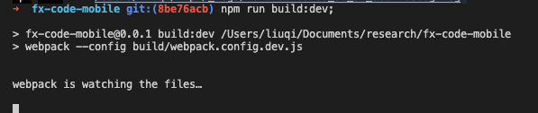

  编译结束之后控制台一堆插件的打包信息，无法直观的看出bundle的信息：
  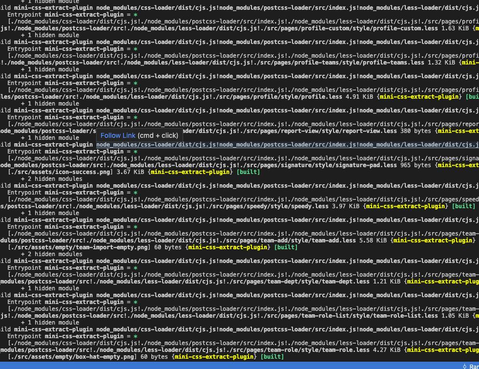

- 解决

  首先需要展示打包的进度和时间，我一开始想到的是使用webpack自带的插件webpack.ProgressPlugin，但它的效果展示有限，只能在左下角展示一串时间的数字，后来我转向了ProgressBarPlugin：
  ```js
  // 显示打包进度
  new ProgressBarPlugin({
      width: 100,
      format: `webpack build [:bar] ${chalk.green.bold(':percent')} (:elapsed seconds)`,
      clear: false
  })
  ```

  它非常的好用，不仅可以结合chalk改变时间的颜色，还可以展示打包进度条，效果如下面问题分析中的图片所示。

  同时我们希望控制台只展示有效的bundle信息，这个可以通过设置stats来实现：
  ```js
  stats: {
      // 清除一些插件如mini-css-extract-plugin大量无效的控制台log
      children: false,
      // 清除入口文件的控制台log
      entrypoints: false,
      modules: false
  },
  ```


### 速度

- 问题

  fx-code-mobile这个项目在一开始的编译速度极慢，首次编译需要一分钟
  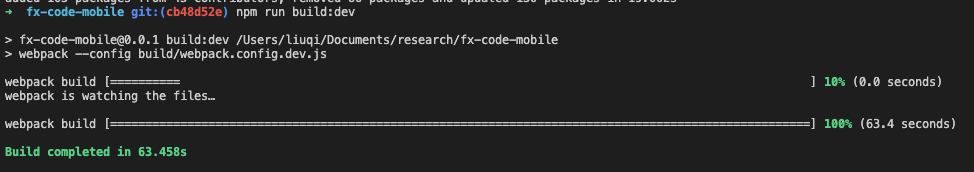

  增量编译10s，开发等待的时间长，效率低
  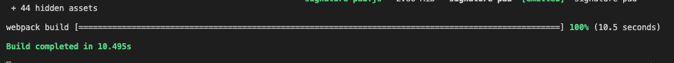

- 解决

  这个阶段可以结合2个插件来做更细致的分析：

  - **BundleAnalyzerPlugin**

    这个插件主要用来查看bundle打包的结果，通过效果图可以看出哪些bundle体积过大需要优化，比如之前一直用的moment.js，发现它体积巨大而且包含一些无用的模块像locale，后来用dayjs替换后体积小了很多

    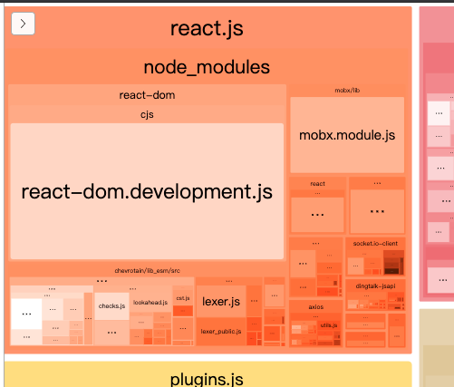

    类似于react这种类型的第三方库，可以加入dll中，来提升开发环境打包速度，但是对于生产环境不提倡使用，因为dll无法tree shaking，关于dll的使用网上有很多教程，这里不再赘述

  - **SpeedMeasurePlugin**

    这个插件主要用来分析打包过程中各个阶段的耗时：

    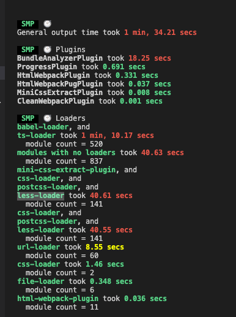

    从上面的分析可以看出：
    
      1. BundleAnalyzerPlugin这个插件本身就很耗时，所以性能分析必须要跑在一个单独的环境中，它要与开发环境分开

      2. ts-loader和babel-loader非常耗时，对于这种长时间编译typescript的操作，可以配合thread-loader开启多线程来加速，如下所示：
      
      ```js
      {
          test: /.tsx?$/,
          use: [
              'babel-loader?cacheDirectory=true',
              // 使用缓存提速
              'cache-loader',
              // 开启独立worker线程编译
              'thread-loader',
              // 配合thread-loader一起使用时，要开启happyPackMode
              { loader: 'ts-loader', options: { happyPackMode: true } } 
          ],
          exclude: [
              /node_modules/,
              path.join(basePath, 'src/plugins')
          ]
      },
      {
          test: /.jsx?$/,
          exclude: [
              /node_modules/,
              path.join(basePath, 'src/plugins')
          ],
          use: [
              // 开启独立worker线程编译
              'thread-loader',
              'babel-loader?cacheDirectory=true'
          ]
      }
      ```
      注意thread-loader只适用于耗时较长的loader，如果过多的使用它，线程资源的开销时间会大于它节省的时间，反而会延长打包时间，优化之后的效果如下：

      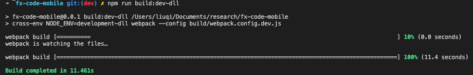

      可以看到，优化后webpack的打包速度从60s减低到12s

### 其他优化

- 配合`style-resources-loader`实现全局样式的自动注入，开发者无需在每个组件的样式中手动import全局的样式

  ```js
  {
      test: /\.less$/,
      use: [
          MiniCssExtractPlugin.loader,
          'css-loader',
          'postcss-loader',
          'less-loader',
          {
              loader: 'style-resources-loader',
              options: {
                  patterns: [
                      path.join(__dirname, '../src/style/lib/*.less'),
                      path.join(__dirname, '../src/style/lib/themes/default.less')
                  ]
              }
          }
      ],
      exclude: /node_modules/
  },
  ```

## 生产环境的性能提升

生产环境更看重网站的加载速度，这涉及到合理的代码分割，关键资源的预加载，请求链路和文件体积的优化

先看看优化前后的entrypoint的对比，用实力说话：

- 优化前

  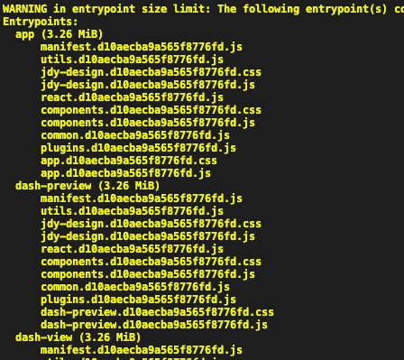

- 优化后

  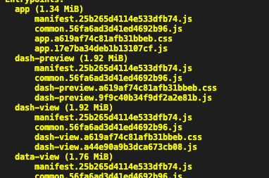

优化后不仅仅size变小了，每个页面的体积也不一样了，下面是详细的优化过程：

### 入口文件体积

- 问题

  做过这么多项目，还从来没看到过entrypoint有3.26M这么大，去lighthouse测一下跑分呢，果然也很惨：
  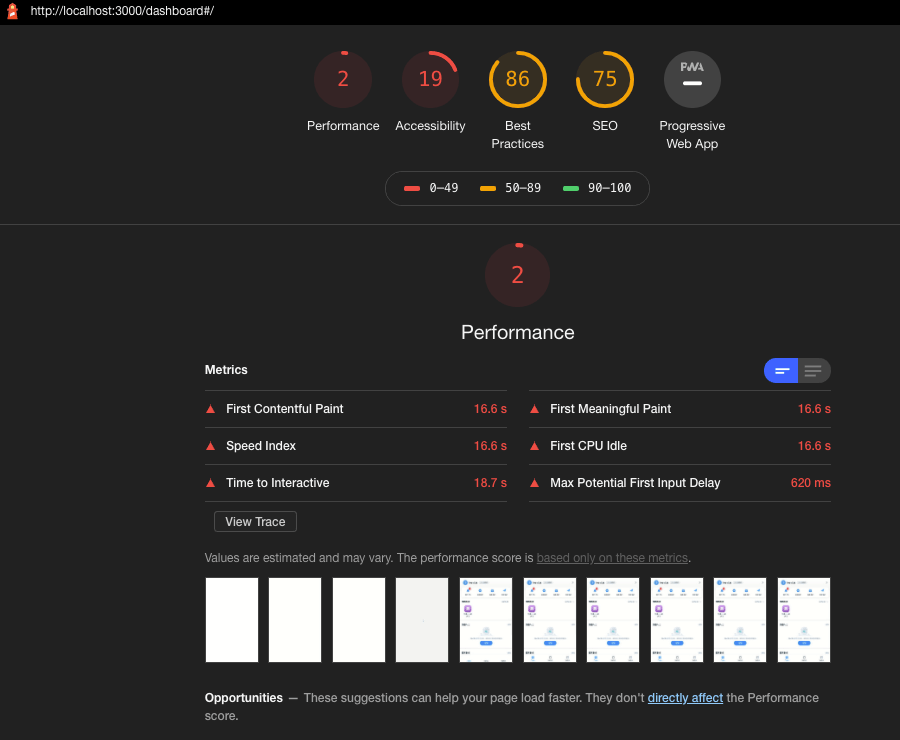

  看了webpack的配置，才发现了问题所在：
  ```js
  /* eslint-disable */
  const path = require('path');
  const HtmlWebpackPlugin = require('html-webpack-plugin');
  const PugWebpackPlugin = require('html-webpack-pug-plugin');

  const glob = require("glob");

  const basePath = path.resolve(__dirname, '../');
  const outputPath = path.join(basePath, 'dist');
  const htmlPluginArray= [];

  function getEntry() {
      const entry = {};
      // 读取入口
      glob.sync(path.resolve(basePath, 'views/*/*.pug'))
          .forEach(function (filePath) {
              const [p, appName, fileName] = filePath.match(/\/views\/(.+)\/(.+).pug/);
              entry[appName] = path.join(basePath, 'views/' + appName + '/index.tsx');
              // 多页面配置
              htmlPluginArray.push({
                  template: path.join(basePath, 'views/' + appName + '/' + fileName + '.pug'),
                  filename: fileName + '.pug',
                  chunks: ['common', 'jdy-design', 'utils', 'react', 'components', 'plugins', appName]
              });
          });
      return entry;
  }

  function getHtmlPlugin() {
      const plugins = htmlPluginArray.map(function (config) {
          return new HtmlWebpackPlugin({
              template: config.template,
              filename: config.filename,
              chunks: config.chunks,
              minify: {
                  removeComments: true,
                  collapseWhitespace: true
              },
              inject: true
          });
      });
      plugins.push(new PugWebpackPlugin());

      return plugins;
  }

  module.exports = {
      entry: getEntry(),
      output: {
          filename: '[name].[hash].js',
          path: outputPath,
          publicPath: '/mobile/'
      },
      plugins: getHtmlPlugin(),
      optimization: {
          runtimeChunk: {
              name: "manifest"
          },
          splitChunks: {
              // 避免无意义的cacheGroups
              minSize: 10000,
              minChunks: 6,
              cacheGroups: {
                  "common": {
                      enforce: true,
                      test: /[\\/]node_modules[\\/]/,
                      name: "common",
                      chunks: "initial",
                      priority: 1,
                      minChunks: 2
                  },
                  "jdy-design": {
                      enforce: true,
                      test: /[\\/]node_modules[\\/](@fx-ui)[\\/](jdy-design-mobile)[\\/]/,
                      name: "jdy-design",
                      chunks: "initial",
                      priority: 2
                  },
                  "utils": {
                      enforce: true,
                      test: /[\\/]node_modules[\\/](dayjs|lodash)[\\/]/,
                      name: "utils",
                      chunks: "initial",
                      priority: 2
                  },
                  "react": {
                      enforce: true,
                      test: /[\\/]node_modules[\\/](react|react-dom|react-router-dom|react-intl-universal|react-sortable-hoc|axios|mobx|mobx-react-lite|chevrotain|socket.io-client|react-transition-group|dingtalk-jsapi)[\\/]/,
                      name: "react",
                      chunks: "initial",
                      priority: 2
                  },
                  "components": {
                      enforce: true,
                      test: /[\\/]src[\\/](components|container)[\\/]/,
                      name: 'components',
                      chunks: "all",
                      priority: 1
                  },
                  "plugins": {
                      enforce: true,
                      test: /[\\/]src[\\/]plugins[\\/]/,
                      name: 'plugins',
                      chunks: "all",
                      priority: 1
                  }
              }
          }
      }
  };

  ```

  上面的配置实际上是将一些文件强行合并，再强行注入到页面当中，这相当于放弃了按需加载的能力

- 解决

  1. 去除这种splitChunks的强行合并，让文件按照依赖关系自行的合并
  
  2. 去除强行的chunk注入，页面模版(.pug)只需注入顶层模块(即`chunks: [appName]`)就好：

      ```js
      /* eslint-disable */
      const path = require('path');
      const HtmlWebpackPlugin = require('html-webpack-plugin');
      const PugWebpackPlugin = require('html-webpack-pug-plugin');

      const glob = require("glob");

      const basePath = path.resolve(__dirname, '../');
      const outputPath = path.join(basePath, 'dist');
      const htmlPluginArray= [];

      function getEntry() {
          const entry = {};
          // 读取入口
          glob.sync(path.resolve(basePath, 'views/*/*.pug'))
              .forEach(function (filePath) {
                  const [p, appName, fileName] = filePath.match(/\/views\/(.+)\/(.+).pug/);
                  entry[appName] = path.join(basePath, 'views/' + appName + '/index.tsx');
                  // 多页面配置
                  htmlPluginArray.push({
                      template: path.join(basePath, 'views/' + appName + '/' + fileName + '.pug'),
                      filename: fileName + '.pug',
                      chunks: [appName]
                  });
              });
          return entry;
      }

      function getHtmlPlugin() {
          const plugins = htmlPluginArray.map(function (config) {
              return new HtmlWebpackPlugin({
                  template: config.template,
                  filename: config.filename,
                  chunks: config.chunks,
                  minify: {
                      removeComments: true,
                      collapseWhitespace: true
                  },
                  inject: true
              });
          });
          plugins.push(new PugWebpackPlugin());

          return plugins;
      }

      module.exports = {
          entry: getEntry(),
          output: {
              filename: '[name].[hash].js',
              path: outputPath,
              publicPath: '/mobile/'
          },
          plugins: getHtmlPlugin(),
          optimization: {
              runtimeChunk: {
                  name: "manifest"
              },
              splitChunks: {
                  // 避免无意义的cacheGroups
                  minSize: 10000,
                  minChunks: 6,
                  cacheGroups: {
                      "common": {
                          enforce: true,
                          // jdy-design-mobile将会被按需加载，所以不需要打包到common中
                          test: /[\\/]node_modules[\\/](?!(@fx-ui[\\/]jdy-design-mobile)[\\/])/,
                          name: "common",
                          chunks: "initial",
                          priority: 1,
                          minChunks: 2
                      }
                  }
              }
          }
      };
      ```
    
  3. npm包按需加载
  
      因为`@fx-ui/jdy-design-mobile`这个库经过改造，已经支持按需引入了(具体过程可以看这篇文章[如何让npm包支持tree-shaking](npm-tree-shaking))，所以无需再把它打包进common中

  4. code split

      - 路由组件按需加载
        ```ts
        // App.tsx
        import React, { lazy, Suspense } from 'react';
        import {
          HashRouter as Router,
          Route,
          RouteComponentProps,
          Switch,
          Redirect
        } from 'react-router-dom';
        import Intl from 'react-intl-universal';
        import { useJssdk, useLocale, useStores } from '../../hooks';

        const DashboardPage = lazy(() => import(/* webpackChunkName: "dashboard" */ '../dashboard'));
        const FlowCenterPage = lazy(() => import(/* webpackChunkName: "flow-page" */ '../flow-center'));
        const FlowManagePage = lazy(() => import(/* webpackChunkName: "flow-page" */ '../flow-manage'));
        const FlowStashPage = lazy(() => import(/* webpackChunkName: "flow-page" */ '../flow-stash'));
        const AppViewPage = lazy(() => import(/* webpackChunkName: "app-view" */ '../app-view'));
        const TemplateCenterPage = lazy(() => import(/* webpackChunkName: "template-page" */ '../template-center/TemplateCenter'));
        const TemplateCategoryPage = lazy(() => import(/* webpackChunkName: "template-page" */ '../template-center/TemplateCategory'));
        const SpeedyPage = lazy(() => import(/* webpackChunkName: "speedy" */ '../speedy'));
        const DashPage = lazy(() => import(/* webpackChunkName: "dash" */ '../dash'));
        const TeamPage = lazy(() => import(/* webpackChunkName: "team-page" */ '../team'));
        const TeamAddPage = lazy(() => import(/* webpackChunkName: "team-page" */ '../team-add'));
        const TeamRolePage = lazy(() => import(/* webpackChunkName: "team-page" */ '../team-role'));
        const TeamRoleListPage = lazy(() => import(/* webpackChunkName: "team-page" */ '../team-role-list'));
        ```

      - 第三方公用插件按需加载

        ```ts
        useEffect(() => {
            // @ts-ignore
            import(/* webpackChunkName: "vancharts-all" */ '../../plugins/vancharts-all').then(Vancharts => {
                if (!thisRef.current.myChart) {
                    thisRef.current.myChart = Vancharts.init(chartRef.current);
                }
                setEmpty(false);
                initData();
            })
        }, [linkFilter, compFilter]);
        ```
        
      代码分割需要注意分割的颗粒度，不能过大也不能过小


### 多页面打包的陷阱

- 问题

  如果只是少数几个页面比较大也就算了，但仔细一看后发现所有的页面都是一样的体积
  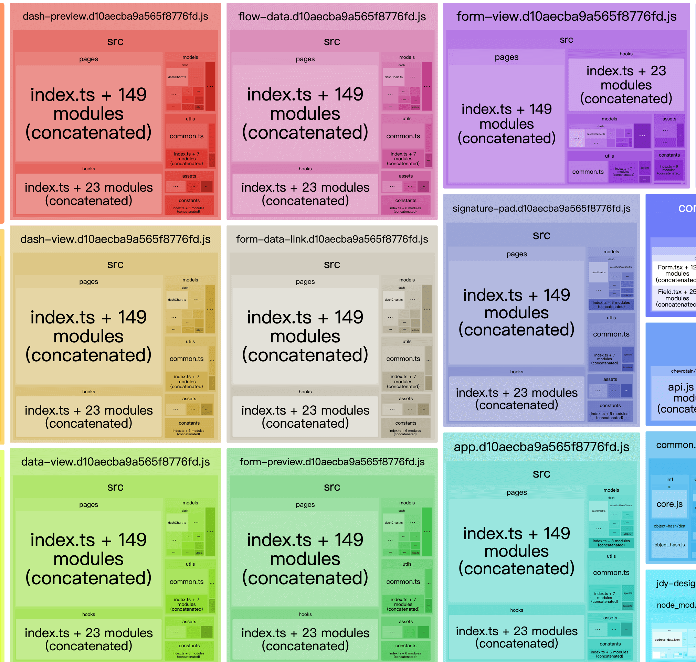
  每个entrypoint都有着相同的pages，hooks，utils等等，即使每个页面下面使用的组件是不同的，打包之后的所有页面也变成了体积完全相同的一坨

- 解决

  经过一番研究，最终在这个issue找到了答案：
  https://github.com/webpack/webpack/issues/9607

  作者说在webpack 5之前，中心化的re-export会让按需加载失效

  ```ts
  // components/index.ts

  export { default as IconFont } from './icon-font';
  export { default as EntryIcon } from './entry-icon';
  export { default as AppIcon } from './app-icon';
  export { default as FlowList } from './flow-list';
  export { default as MemberSelect } from './member-select';
  export { default as SearchInput } from './search-input';
  export { default as ScalableTextarea } from './scalable-textarea';
  export { default as MultiText } from './multi-text';
  export { default as DynamicDate } from './dynamic-date';
  export { default as Text } from './text';
  export { default as IntlPhone } from './intl-phone';
  export { default as DeptGroup } from './dept-group';
  export { default as AppEntryList } from './app-entry-list';
  export { default as CreateAppDrawer } from './create-app-drawer';
  export { default as Form } from './form';
  export { default as Upload } from './upload';
  export { default as FileThumb } from './file-thumb';
  export { default as Progress } from './progress';

  ```

  解决方案就是要么升级webpack版本，要么避免这种中心化re-export，下图可以看到，不用re-export之后，页面的体积开始分化
  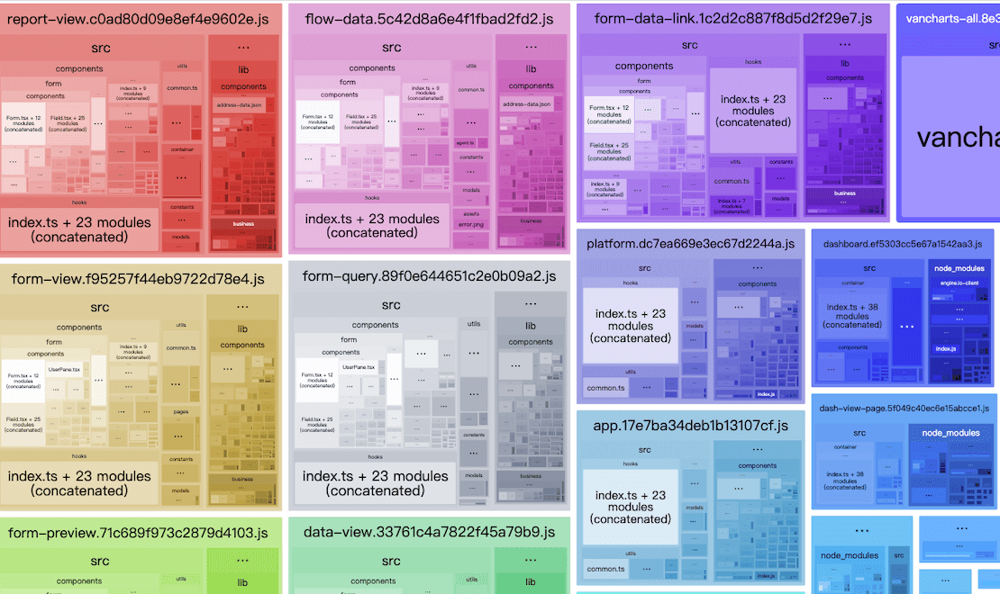

## 总结

开发环境主要是利用webpack一些插件，配置stats选项优化了控制台输出，并且使用`thread-loader`和`cache-loader`加速ts和babel的编译，配合dll一起加速webpack打包

生产环境主要是通过代码分割，按需引入，避免中心化的re-export等手段减少文件的体积，加快页面的加载速度

## 相关链接

- [react 代码分割](https://zh-hans.reactjs.org/docs/code-splitting.html)
- [webpack Build Performance](https://webpack.js.org/guides/build-performance/#statstojson-speed)