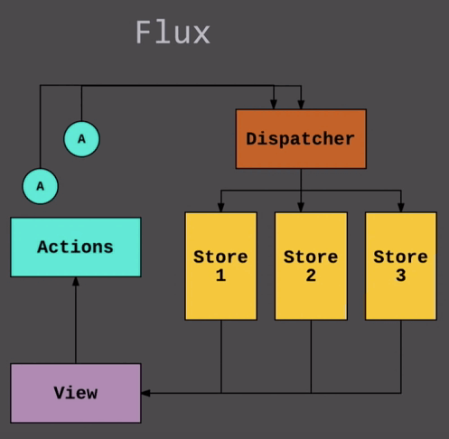

flux data flow
=======


good framework or library knows how to encapsulate complexity and open flexibility

### what is flux ?

尽管flux是为react开发的一种实现单向数据流的应用架构，但它自己声称更像是一种设计模式:


它有着以下核心概念:
- action，告诉flux哪一种state需要改变
- view，基于React，触发action，渲染state
- store，基于EventEmitter，存储着改变state的策略，和每个策略具体的实现
- dispather，接受action，广播给订阅自己的store


### go through the flux data flow

首先从action开始，action一般分为actionType和action函数:

```js
// 应用层
import TodoActionTypes from './TodoActionTypes';
import TodoDispatcher from './TodoDispatcher';

const Actions = {
  addTodo(text) {
    TodoDispatcher.dispatch({
      type: TodoActionTypes.ADD_TODO,
      text,
    });
  },
}
```

1. `addTodo()`会被绑定到view的事件上作为handler触发
2. dispather派发了某个actionType，同时带上了payload，也就是上面的text
3. 订阅dispather的store收到了action，并根据payload和oldState生成新的state
4. view视图自动更新

整个流程很简单，但暴露出了很多疑点:

1. `addTodo()`这个action是如何绑定到view上面的 ？
2. store是如何收到actionType和payload ? 这是利用了发布-订阅模式嘛？
3. view视图是如何自动更新的？

flux需要解决上面的这些问题，并封装复杂性，让用户只需要定义action, store, view

### how flux encapsulate the complexity ?

1. `addTodo()`这个action是如何绑定到view上面的 ？

这个问题可以归结为`addTodo()`是如何挂载到react组件的props上的，再进一步可以理解为react组件是如何连接到store，state的，在redux中我们使用connect方法，在flux中也是类似的:

```js
// 应用层，连接视图和store
export default Container.createFunctional(AppView, getStores, getState);

// 源码层，将state计算之后传入view
function createFunctional<Props, State, A, B>(
  viewFn: (props: State) => React.Element<State>,
  getStores: (props?: ?Props, context?: any) => Array<FluxStore>,
  calculateState: (prevState?: ?State, props?: ?Props, context?: any) => State,
  options?: Options,
): ReactClass<Props> {
  class FunctionalContainer extends Component<void, Props, State> {
    state: State;
    // 这里将state传入react了函数式组件中
    render(): React.Element<State> {
      return viewFn(this.state);
    }
  }
  // create其实是利用了反向继承，扩展了FunctionalContainer的state
  return create(FunctionalContainer, options);
}

// create()返回了ContainerClass，Base即使上面的FunctionalContainer
class ContainerClass extends Base {
  constructor(props: Props, context: any) {
    super(props, context);
    const calculatedState = getState(undefined, props, context);
    this.state = {
      // 这里是用新的state来覆盖就的state
      ...(this.state || {}),
      ...calculatedState,
    };
  }
}
```

2. store是如何收到actionType和payload ? 这是利用了发布-订阅模式嘛？

每个store在定义的时候都会有一些要求:

```js
// 应用层
import {ReduceStore} from 'flux/utils';
import TodoActionTypes from './TodoActionTypes';
import TodoDispatcher from './TodoDispatcher';

// 这里必须继承ReduceStore
class TodoDraftStore extends ReduceStore {
  constructor() {
    // 必须传入单例dispather作为入参
    super(TodoDispatcher);
  }
  // 提供初始state
  getInitialState() {
    return '';
  }
  // 改变state，有点像redux的reducer
  reduce(state, action) {
    switch (action.type) {
      case TodoActionTypes.ADD_TODO:
        return '';

      case TodoActionTypes.UPDATE_DRAFT:
        return action.text;

      default:
        return state;
    }
  }
}

// 源码层，store调用了dispather的api来注册自己到dispather(FluxStore.js)，典型的依赖注入
// 这里的dispatchToken有什么用呢？其实是dispather用来defer某些store的，它会作为`waitFor`
// 的参数，这也是dispather和pub-sub模式的区别之一
this._dispatchToken = dispatcher.register((payload) => {
  this.__invokeOnDispatch(payload);
});

// 源码层，register()主要是将store加入callbacks队列，这样当dispatch的时候，
// 相应的store就会被取出来，并传入最新的state到store
// 这里和pub-sub最大的区别就是没有'eventName'这种命名空间，所以是真正的"广播"
register(callback: (payload: TPayload) => void): DispatchToken {
  var id = _prefix + this._lastID++;
  this._callbacks[id] = callback;
  return id;
}


```

3. view视图是如何自动更新的？

这里主要是Container.createFunctional内部完成的:

```js
// 源码层，回到之前的代码中，这里主要是addListener()将setState加入了_fluxContainerSubscriptions的callbacks数组中
class ContainerClass extends Base {
  constructor(props: Props, context: any) {
    super(props, context);
    this._fluxContainerSubscriptions.addListener(() => {
      this.setState(
        (prevState, currentProps) => getState(
          prevState,
          currentProps,
          context,
        ),
      );
    });
  }
}

// 将setState加入_fluxContainerSubscriptions的callbacks数组
addListener(fn: () => void): void {
  this._callbacks.push(fn);
}

// 源码层，callCallbacks将会依次执行每个setState来更新视图，不过执行权交给了FluxStoreGroup
const callCallbacks = () => {
  if (changed) {
    this._callbacks.forEach(fn => fn());
    changed = false;
    if (__DEV__) {
      // Uncomment this to print the stores that changed.
      // console.log(changedStores);
      changedStores = [];
    }
  }
};
this._storeGroup = new FluxStoreGroup(stores, callCallbacks);

// 源码层，FluxStoreGroup在内部执行了callback()，也就是执行相应的setState()
constructor(stores: Array<FluxStore>, callback: Function): void {
  this._dispatcher = _getUniformDispatcher(stores);

  // Precompute store tokens.
  var storeTokens = stores.map(store => store.getDispatchToken());

  // Register with the dispatcher.
  this._dispatchToken = this._dispatcher.register(payload => {
    this._dispatcher.waitFor(storeTokens);
    callback();
  });
}
```


flux很好的封装了复杂性，将改变state的灵活性开放出来，但是它和redux相比，还有一些不足的地方: 

1. flux没有封装dispather，需要你手动定义，而redux做了封装并将它通过函数(mapDispatchToProps)的参数暴露出来
2. flux的action只是简单的对象，redux通过中间件的增强，它的action可以是复杂的函数或者promise
3. flux的多个store让调试变得困难 

[这篇文章](https://medium.com/edge-coders/the-difference-between-flux-and-redux-71d31b118c1)详细介绍了redux和flux的对比