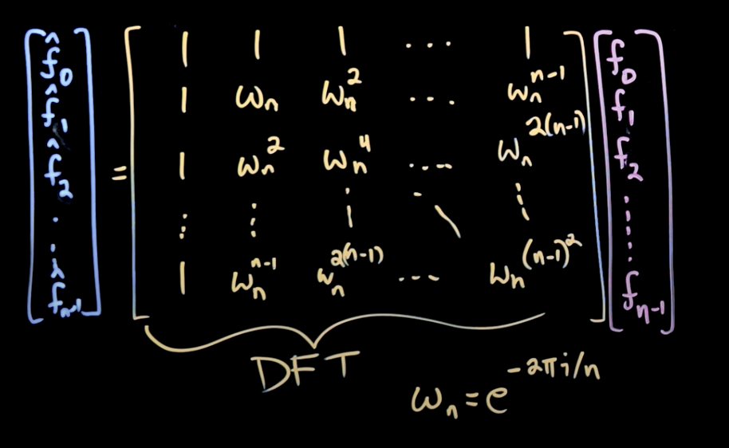

DFT in javascript
===

### 前言

傅立叶变换被称为**21世纪最重要的算法**，从人脸识别到语音控制，甚至我们人脑每天辨别各种声音的过程，都与它息息相关。

在研究DFT的过程中，我发现网上有很多关于DFT代码实现，但是大部分的实现都晦涩难懂，其实也能理解，毕竟`傅立叶`这三个字是很多人大学时代的噩梦

而本文试图从一个前端开发者的角度，解读DSP.js这个库中的DFT源码，挑战业界对与js这门语言只能写写页面的错误认知。

### 目录
  - 一. what is dft?
  - 二. how to code it with javascript

### 正文

#### 一. what is DFT ?
DFT之所以被称为离散傅立叶变换(Discrete Fourier Transform)，是因为它要处理的数据是自然界数据(比如声波)的采样，比如我们调用浏览器的[Web Audio API](https://developer.mozilla.org/zh-CN/docs/Web/API/Web_Audio_API)进行录音的时候，得到的是采样率44100Hz的声音信号(在js里是`ArrayBuffer`)。

这个时域(x轴时间，y轴是振幅)上的信号经过DFT转换之后，输出为频域(x轴频率, y轴振幅)上的信号，在频域上，我们能更好的分析这个声音的特征。

然而本文的重点是实现不于在理论，如果你对理论特别感兴趣，这里有一篇非常的棒的[文章](https://zhuanlan.zhihu.com/p/19759362)

#### 二. how to code it with javascript
进入到第二部分，假设你已经掌握了DFT的原理，所以我直接给出其数学定义


用fn代替xn，用^fn代替Xn，用ωn代替e^{-2πi/n}之后，这个等式实际上可以用矩阵来表示



(华盛顿大学的教授做了很简洁的[视频课程](https://www.youtube.com/watch?v=E8HeD-MUrjY)，介绍了公式到矩阵的推导过程)

所以只要能构造出这样的一个DFT矩阵，我们就能把右边的f(0)...f(n-1)时域信号转化为左侧的^f(0)...^f(n-1)的频域信号

所以算法的核心就是构建ωn矩阵，然后和右侧fn数组做[矩阵乘法](https://zh.wikipedia.org/wiki/%E7%9F%A9%E9%99%A3%E4%B9%98%E6%B3%95)运算

虽然ωn中的i表明它是一个复数，但是通过`欧拉公式`，我们仍然可以在代码中用三角函数表示它

```
e^{ix} = cos x + isin x
```

来看一下[DSP.js](https://github.com/corbanbrook/dsp.js/)中DFT的实现
```js
function DFT(bufferSize, sampleRate) {
  FourierTransform.call(this, bufferSize, sampleRate);
  // ...
}
```

DFT通过借用构造函数的方式继承了`FourierTransform`的一些属性和方法，其中值得一提的是`calculateSpectrum`这个方法:

```js
// 计算频谱的值
this.calculateSpectrum = function() {
  var spectrum  = this.spectrum,
      real      = this.real,
      imag      = this.imag,
      bSi       = 2 / this.bufferSize,
      sqrt      = Math.sqrt,
      rval, 
      ival,
      mag;

  for (var i = 0, N = bufferSize/2; i < N; i++) {
    // 实部
    rval = real[i];
    // 虚部
    ival = imag[i];
    // 即对于复数z=a+bi，它的模：∣z∣=√（a^2+b^2)
    mag = bSi * sqrt(rval * rval + ival * ival);
    spectrum[i] = mag;
  }
};
```

算法的核心是ωn矩阵和fn数组(列矩阵)做矩阵乘法运算，因为ωn是复数，所以运算出结果也是个复数`rval + i * ival`，最终频域的值其实上是其模值，但为什么模值需要乘以个`bSi`呢，我经过一番研究，在[wiki](https://en.wikipedia.org/wiki/DFT_matrix#Definition)上找到了算是比较清晰的解释：

`bSi`只是人们在计算DFT时常用的习惯，它的值会根据实际的情况变化，比如wiki上是`1/√bufferSize`，这里是`2/bufferSize`，对DFT的结果不会有太大的影响，但是这个值可以让结果更加的平缓

下面是本文的重点内容，即用**代码实现矩阵乘法运算**:

首先来看下面的推导:
```bash
e^{ix} = cos x + isin x
ωn = e^{-2πik/n} = cos(2πk/n) - i * sin(2πk/n)
```
n就是源数据的总数`bufferSize`，于是就有了下面的`sinTable`和`cosTable`，但是为什么sin和cos的总长度N是`bufferSize/2 * bufferSize`呢？这里先留个悬念。

```js
function DFT(bufferSize, sampleRate) {
  FourierTransform.call(this, bufferSize, sampleRate);
  // 思考这里是为什么？
  var N = bufferSize/2 * bufferSize;
  var TWO_PI = 2 * Math.PI;

  this.sinTable = new Float64Array(N);
  this.cosTable = new Float64Array(N);

  for (var i = 0; i < N; i++) {
    this.sinTable[i] = Math.sin(i * TWO_PI / bufferSize);
    this.cosTable[i] = Math.cos(i * TWO_PI / bufferSize);
  }
}
```

准备好了ωn之后，就可以进行实际的计算了，下面的代码中buffer就是矩阵中的fn，可以看到fn与ωn的实部计算产生了频谱信号的实部，fn与ωn的虚部计算产生了频谱信号的虚部。可以看出`k*n`的最大值是`this.bufferSize/2 * buffer.length`，是不是和前面的`N = bufferSize/2 * bufferSize`很像？

没错，N的取值就是为了防止cosTable和sinTable在计算过程中溢出

```js
DFT.prototype.forward = function(buffer) {
  var real = this.real, 
      imag = this.imag,
      rval,
      ival;

  for (var k = 0; k < this.bufferSize/2; k++) {
    rval = 0.0;
    ival = 0.0;

    for (var n = 0; n < buffer.length; n++) {
      // fn与ωn的实部计算产生了频谱信号的实部
      rval += this.cosTable[k*n] * buffer[n];
      // fn与ωn的虚部计算产生了频谱信号的虚部
      ival += this.sinTable[k*n] * buffer[n];
    }

    real[k] = rval;
    imag[k] = ival;
  }
  return this.calculateSpectrum();
};
```

对照那张矩阵图来看`forward()`方法，我们知道`forward()`有二层循环，内层循环代表着ωn的一行和fn那一列相乘，外层循环的`k`值就是ωn的总行数，就是^fn频谱的数据总长度，问题是为什么k的最大值是`this.bufferSize/2`呢？
```js
k < this.bufferSize/2
```
因为矩阵向量ωn具有下面2个特性:
- 周期性

  

- 对称性

  

所以频谱的信号只需要分析一半就可以了，另一半是共轭的。

### 后续
研究DFT的起源的是因为最近在做一个语音相关的项目(如果你很感兴趣，欢迎与我交流)，对于项目级的应用来说，DFT更像是个数学上的概念，下一章将会介绍速度更快的FFT(快速傅立叶变换)的代码实现