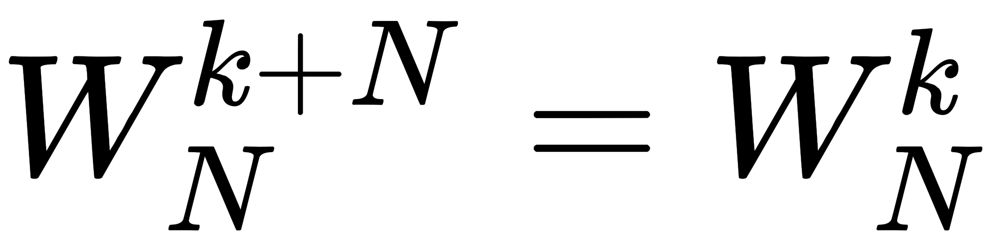
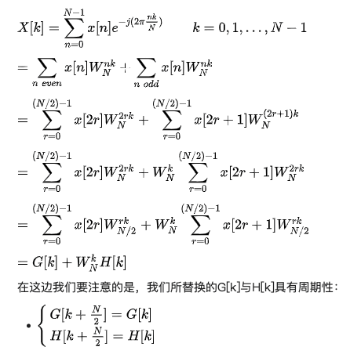
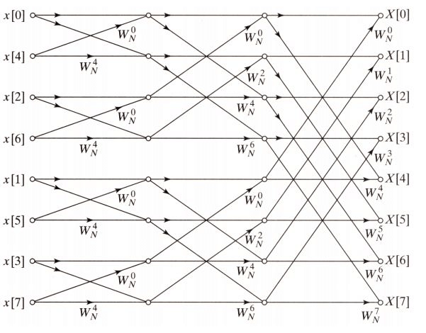
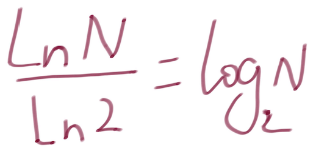
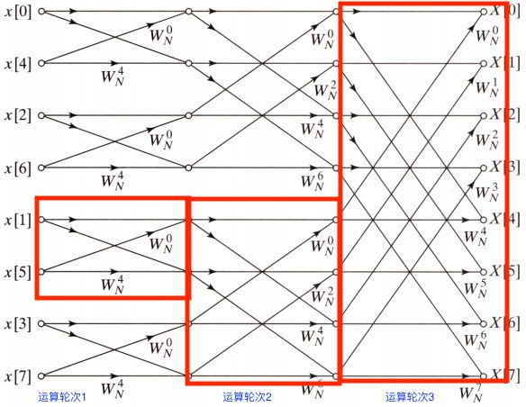

FFT in javascript
========

### 前言

在上一篇文章[DFT in javascript](../dft-in-javascript/dft-in-javascript.md)中，我们介绍了傅立叶变换在javascript层面的基本实现，然而在实际的项目中，我们还是会用效率更高的[FFT(快速傅立叶变换)](https://zh.wikipedia.org/wiki/%E5%BF%AB%E9%80%9F%E5%82%85%E9%87%8C%E5%8F%B6%E5%8F%98%E6%8D%A2)。

### 目录

  - 一. why FFT ?
  - 二. FFT 的原理
  - 三. how to code it with javascript

### 正文

#### 一. why FFT ?
DFT算法的时间复杂度是O(n^2)，而FFT可以降低到O(nlog2(n))

#### 二. FFT 的原理

要理解FFT的原理还是比较简单的，无非就是利用矩阵向量ωn的2个特性:
- 周期性

  

- 对称性

  

来对`DFT matrix`做一些简化：


关于FFT的算法实现有很多个版本，最常见的还是[Cooley-Tukey算法](https://zh.wikipedia.org/wiki/%E5%BA%93%E5%88%A9%EF%BC%8D%E5%9B%BE%E5%9F%BA%E5%BF%AB%E9%80%9F%E5%82%85%E9%87%8C%E5%8F%B6%E5%8F%98%E6%8D%A2%E7%AE%97%E6%B3%95)

下面是具体的公式推导，有兴趣的可以演算一下，这里的H[k]是奇数行，G[k]是偶数行，因为奇数行是总行数的一半，这也验证了上篇文章中的结论："k只需要计算到N/2就可以了"。



进一步的研究发现G[k]和H[k]也是周期性的，所以我们可以将G[k]继续拆分成奇数行和偶数行，并一直递归的拆分下去，直到无法拆分为止。

每一次递归的拆分，k值都会变成原来的一半，最终发现k值从DFT算法的n变成了log2(n)，于是FFT算法复杂度也就变成了O(nlog2(n))，其中n是ωn矩阵的列数没有变，而行数k缩短到了log2(n)

从下面的蝶形网络看出最终的计算过程


这个过程主要有2点值得注意:

1. 蝶形网络的输入不是顺序的，这是为了让最终的输出是顺序，这样的输入顺序其实是对奇数和偶数分别拆分成更小的奇数和偶数的递归运算的结果，如何通过代码来实现这样的过程呢？这里先留个悬念

2. 8个数字信号的输入，只需要三轮计算，这也验证了k = log2(n)

#### 三. how to code it with javascript

这部分主要是分析[DSP.js](https://github.com/corbanbrook/dsp.js/)中FFT的源码实现

先解开之前的悬念，如何让输入变成蝶形网络指定的顺序

```ts
function FFT(bufferSize, sampleRate) {
  FourierTransform.call(this, bufferSize, sampleRate);
   
  this.reverseTable = new Uint32Array(bufferSize);

  var limit = 1;
  var bit = bufferSize >> 1;

  var i;
  // 比特反转排列(bit-reversed order) 算法
  while (limit < bufferSize) {
    for (i = 0; i < limit; i++) {
      this.reverseTable[i + limit] = this.reverseTable[i] + bit;
    }

    limit = limit << 1;
    bit = bit >> 1;
  }
  // sinTable和cosTable组成ωn，具体原因可以看上篇文章(DFT in javascript)
  this.sinTable = new Float64Array(bufferSize);
  this.cosTable = new Float64Array(bufferSize);

  for (i = 0; i < bufferSize; i++) {
    this.sinTable[i] = Math.sin(-Math.PI/i);
    this.cosTable[i] = Math.cos(-Math.PI/i);
  }
}
```

这里其实是对`比特反转排列(bit-reversed order)`算法的实现，reverseTable存储了输入的顺序，到时候我们取数的话就只需：

```js
for (i = 0; i < bufferSize; i++) {
    real[i] = buffer[reverseTable[i]];
    imag[i] = 0;
}
```

OK，解决了输入顺序的问题，下面就是实际的计算频谱：

```js
FFT.prototype.forward = function(buffer) {
  // Locally scope variables for speed up
  var bufferSize      = this.bufferSize,
      cosTable        = this.cosTable,
      sinTable        = this.sinTable,
      reverseTable    = this.reverseTable,
      real            = this.real,
      imag            = this.imag,
      spectrum        = this.spectrum;

  var k = Math.floor(Math.log(bufferSize) / Math.LN2);

  // 这里因为蝶形网络的深度是log2(n)的原因，所以bufferSize必须是2的幂
  if (Math.pow(2, k) !== bufferSize) { throw "Invalid buffer size, must be a power of 2."; }
  if (bufferSize !== buffer.length)  { throw "Supplied buffer is not the same size as defined FFT. FFT Size: " + bufferSize + " Buffer Size: " + buffer.length; }
```
这里因为蝶形网络的深度是log2(n)的原因，所以bufferSize必须是2的n方，那么怎么判断一个数N是2的幂呢？

数学上其实很简单，直接求log2(n)，然后判断是整数就行了，但是javascript需要绕一下：



于是就有了：

```js
var k = Math.floor(Math.log(bufferSize) / Math.LN2);
```

然后就是先让输出(`real + i * imag`)等于输入，因为对于蝶形网络来说，每一轮计算的输出都是下一轮计算的输入

```js
  var halfSize = 1,
      phaseShiftStepReal,
      phaseShiftStepImag,
      currentPhaseShiftReal,
      currentPhaseShiftImag,
      off,
      tr,
      ti,
      tmpReal,
      i;
  // 让输出(`real + i * imag`)等于输入
  for (i = 0; i < bufferSize; i++) {
    real[i] = buffer[reverseTable[i]];
    imag[i] = 0;
  }
```

再进入while循环就是整个FFT代码的核心部分了，这天书般的代码，花了我整整一周的时间(这还是十年前的代码，汗...)，现在传授给你只需5分钟

```js
  // 首先最外层的循环决定了蝶形网络的层次，halfSize的指数级增长，刚好确定了循环次数是log2(n)
  while (halfSize < bufferSize) {
    phaseShiftStepReal = cosTable[halfSize];
    phaseShiftStepImag = sinTable[halfSize];
    
    currentPhaseShiftReal = 1;
    currentPhaseShiftImag = 0;
    /**
     * 中层循环决定了在一轮蝶形网络运算中，一个运算单元内需要计算的次数
     * 什么是运算单元？这里先留个悬念
     */
    for (var fftStep = 0; fftStep < halfSize; fftStep++) {
      i = fftStep;
      /**
       * 内层循环决定了在一轮蝶形网络运算中，需要处理的运算单元的个数
       * 实际上在每一轮的蝶形运算中，都是先计算第一个运算单元的第一个数和倒数第一个数，然后第二个运算单元的第一个数和倒数第一个数...
       * 然后再第一个运算单元的第二个数和倒数第二个数，第二个运算单元的第二个数和倒数第二个数...
       */
      while (i < bufferSize) {
        off = i + halfSize;
        // ωn * x[4]
        tr = (currentPhaseShiftReal * real[off]) - (currentPhaseShiftImag * imag[off]);
        ti = (currentPhaseShiftReal * imag[off]) + (currentPhaseShiftImag * real[off]);
        // X[4] = x[0] - ωn * x[4]
        real[off] = real[i] - tr;
        imag[off] = imag[i] - ti;
        // X[0] = x[0] + ωn * x[4]
        real[i] += tr;
        imag[i] += ti;

        i += halfSize << 1;
      }

      tmpReal = currentPhaseShiftReal;
      /**
       * 一个运算单元内的每对数(第m个和倒数第m个是一对，他们的计算使用相同的矩阵因子，只不过符号不同)的计算，
       * 都需要不同的矩阵因子ωn，拿上面蝶形网络的第三轮运算的第一个运算单元来说，第二对数的ωn的"上标"是在第一对数的上标的基础上加2，
       * 这个2就是运算单元的总数，也就是bufferSize/Math.pow(2, 1...log2(n))，
       * 所以"上标"的加2，其实是第一对数的ωn(currentPhaseShiftReal + i * currentPhaseShiftImag) 乘以 `phaseShiftStepReal + i * phaseShiftStepImag`
       */
      currentPhaseShiftReal = (tmpReal * phaseShiftStepReal) - (currentPhaseShiftImag * phaseShiftStepImag);
      currentPhaseShiftImag = (tmpReal * phaseShiftStepImag) + (currentPhaseShiftImag * phaseShiftStepReal);
    }

    halfSize = halfSize << 1;
  }

  return this.calculateSpectrum();
};

```

整个蝶形网络的运算是fft的核心内容，整个代码经过了外，中，内三层循环，其中的运算单元如下图的红色框所示所示：



### 后记

- 前端研究FFT是有意义的，在一些语音相关的应用中，前端经常需要通过websocket将语音数据传递到后台去，如果我们能够在前端应用FFT，将声音数据转为频谱(你可以理解频谱是声音的特征)数据，则可以大大降低websocket传输的数据量，不用担心浏览器的性能问题，你可以通过worker来解决

- 研究复杂算法的核心在于观察循环，当你看某个算法觉得无从下手时，不妨先去研究它的`for, while`循环都做了什么

- 我们正在开发一个针对音乐行业的颠覆性应用，如果你是算法相关，或者DSP相关的人员，欢迎加入来分得一杯羹